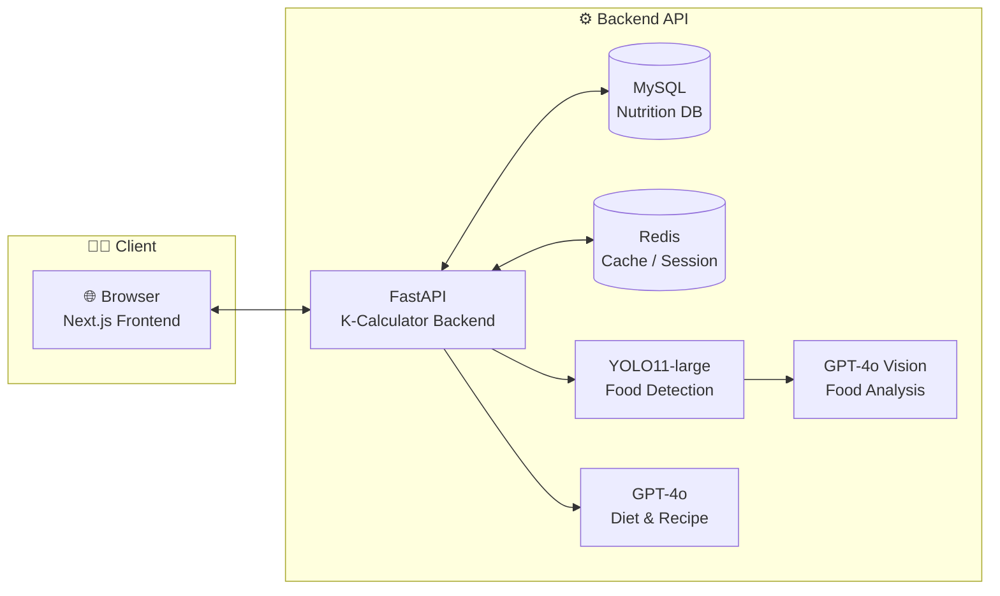
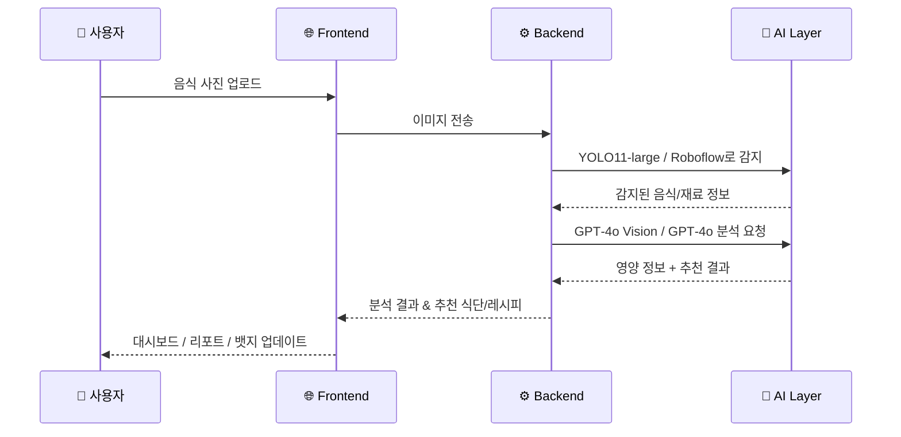

<div align="center">


### 🌱 K-Calculator · Food Calorie Vision


[](#-모노레포-구조)
[](./food-calorie-vision-frontend)
[](./food-calorie-vision-backend)

<br/>

**📸 음식 사진 한 장이면, 오늘 식단은 AI가 챙겨줘요**  
**🥗 영양 분석 · 식단 추천 · 리포트까지 한 번에**  
**🌿 ‘꾸준함’을 도와주는 초록초록 건강 파트너**

<br/>

[🌟 개요](#-프로젝트-한눈에-보기) ·
[🌳 모노레포 구조](#-모노레포-구조) ·
[🧩 아키텍처](#-시스템-아키텍처) ·
[🎨 프론트엔드](#-프론트엔드-frontend) ·
[⚙️ 백엔드](#-백엔드-backend) ·
[🚀 시작하기](#-시작하기) ·
[📊 진행률](#-프로젝트-진행률) ·
[👥 팀](#-팀-소개)

</div>

---

<br/>

## 🌟 프로젝트 한눈에 보기

> *“오늘 뭐 먹었더라…? 이거 칼로리가 얼마나 될까…?”*  
> 그런 고민을 대신 계산해주는 **AI 영양 매니저**입니다.

- 🌱 **K-Calculator** 는:
  - 음식 사진만으로 **무슨 음식인지, 얼마나 먹었는지**를 추정하고
  - 식약처 영양 데이터를 이용해 **칼로리와 영양소를 정밀 계산**하고
  - 나의 목표(감량/유지/증량)에 맞게 **하루 식단과 레시피를 추천**해주고
  - 대시보드와 리포트를 통해 **“요즘 내 식단 상태”를 시각적으로 보여주는** 서비스입니다.

```text
무작정 굶기보다는,
  내 몸을 이해하면서 먹는 연습 🌱
    → 그래서 오래가는 루틴 만들기 💪
```

### 🙋 이런 분께 특히 잘 맞아요

- "샐러드 앞에서 멘탈이 먼저 무너지는 분"
- "칼로리 계산 앱 3일 이상 써 본 적 없는 분"
- "헬스 PT쌤 말은 들었는데, 식단은 아직 막연한 분"
- "사진 찍는 건 괜찮은데, 기록은 너무 귀찮은 분"

<br/>

---

<br/>

## 🌳 모노레포 구조

```text
food-calorie-vision-main/
│
├── food-calorie-vision-frontend/   # 🌿 웹 프론트엔드 (Next.js)
├── food-calorie-vision-backend/    # ⚙️ 백엔드 API (FastAPI)
├── food-calorie-vision-crawling/   # 🥕 음식 이미지/정보 크롤링 (선택)
├── food-calorie-vision-modeling/   # 🧠 추천/분석 모델링 (선택)
│
├── README_NEW.md                   # 👈 이 파일 (통합 README)
└── WBS_업데이트_결과.md            # 📋 프로젝트 WBS & 일정
```

- **Frontend**: 사용자와 만나는 모든 화면, 애니메이션, 리포트 UI
- **Backend**: 인증, 음식 분석, 식단 추천, 건강 점수 API
- **Crawling/Modeling**: 데이터 수집 및 ML/추천 모델 실험용

<br/>

---

<br/>

## ✨ 주요 기능 하이라이트

<div align="center">

<table>
<tr>
<td align="center" width="25%">

### 📸 음식 사진 분석
음식 사진 한 장으로  
칼로리·영양소 자동 분석  
YOLO11-large + GPT-4o Vision

</td>
<td align="center" width="25%">

### 🍱 맞춤 식단 추천
Harris-Benedict 공식 기반  
TDEE/목표 칼로리 계산  
3가지 스타일 식단 옵션 제공

</td>
<td align="center" width="25%">

### 🥕 재료 기반 레시피
냉장고 사진만 찍으면  
사용 가능한 재료 분석 후  
건강 레시피 추천

</td>
<td align="center" width="25%">

### 🏆 점수 & 뱃지 시스템
NRF9.3 건강 점수,  
MY SCORE 대시보드,  
뱃지 수집 & 연속 기록 스트릭

</td>
</tr>
</table>

<br/>

#### 🔎 세부 기능 맵

| 카테고리 | 기능 |
|:---:|:---|
| 👤 **사용자 & 인증** | 이메일 회원가입, 세션 기반 로그인, 프로필 관리, 건강 목표/질환/알레르기 설정 |
| 📸 **음식 분석** | 음식 사진 업로드, YOLO11-large 객체 감지, GPT-4o Vision 후보 추천, 식약처 영양 데이터 매칭 |
| 🍽️ **식단 관리** | 하루 식단 기록, 식사 별(아침·점심·저녁·간식) 기록, 일일 섭취량 요약, 연속 기록 스트릭 |
| 🥗 **식단 추천** | BMR/TDEE 계산, 증량·유지·감량별 칼로리 설정, 3가지 스타일 식단 옵션, 선택한 식단 저장/조회 |
| 🍳 **레시피 추천** | 재료 기반 레시피 추천, 부족 영양소 보완 레시피, 단계별 조리법 안내, 건강 팁 메시지 |
| 📊 **리포트 & 점수** | NRF9.3 기반 건강 점수, 영역별 점수(나트륨·단백질·섬유질 등), 7일·30일 리포트, 대시보드 통계 |
| 🏅 **동기부여 요소** | 뱃지 수집 시스템, 연속 출석·기록 스트릭, 홈·대시보드에서 진행 상황 강조 |
| 💬 **고객센터 & 안내** | 공지사항, 문의 작성/조회, 챗봇 안내 메시지, 설정 페이지 가이드 텍스트 |

<br/>

</div>

<div align="center">

### 🎨 서비스 스냅샷

_※ 실제 화면은 프론트엔드 README에서 더 자세히 볼 수 있어요!_  
[`frontend/README_NEW.md`](./food-calorie-vision-frontend/README_NEW.md)

</div>

<br/>

---

<br/>

## 🧩 시스템 아키텍처



- **Frontend**: Next.js App Router 기반, 세션 인증 + AI 분석 결과를 시각화
- **Backend**: FastAPI + SQLAlchemy + MySQL, AI 호출/DB/비즈니스 로직 담당
- **AI Layer**: YOLOv11-large (음식 탐지), Roboflow 재료 인식 및 탐지 모델(api)로 음식/식재료를 탐지하고, gpt-4o (멀티모달; 비전+텍스트)로 분석 & 추천
- **Infra & 캐싱**: Redis를 사용해 세션/단기 데이터 캐싱과 일부 통계·상태 정보를 빠르게 조회

```text
1️⃣ YOLO11-large / Roboflow 모델로 사진 속 음식·식재료 찾기
2️⃣ GPT-4o Vision으로 맥락 이해 + 영양·상황 분석
3️⃣ GPT-4o로 식단/레시피 추천 문장 생성 ✏️
```

<br/>

---

<br/>

## 🚶 사용자 여정 (User Flow)

> *“실제로는 이렇게 흘러가요”*  

1. **가입 & 설정**
   - 이메일로 간단히 회원가입
   - 체중·키·나이·활동량·건강 목표(감량/유지/증량) 입력
   - 알레르기나 피해야 할 음식도 미리 체크
2. **음식 기록**
   - 식사할 때마다 **사진 한 장 찍기** (또는 갤러리에서 선택)
   - AI가 음식/재료를 인식하고, 섭취량을 추정해서 기록
3. **AI 분석**
   - 사진 속 음식 → YOLO11-large + Roboflow로 감지
   - GPT‑4o Vision이 음식 종류·상황을 이해
   - 식약처 DB와 매칭해서 **칼로리·영양소** 계산
4. **식단·레시피 추천**
   - 오늘 먹은 것 기준으로 **부족한 영양소 보완 식단** 추천
   - 집에 있는 재료 사진으로 **레시피**도 같이 제안
5. **리포트 & 보상**
   - 대시보드에서 **점수·그래프·자주 먹는 음식** 확인
   - 연속 기록, 목표 달성에 따라 **뱃지 수집 & 스트릭 유지**



<br/>

---

<br/>

## 🎨 프론트엔드 (Frontend)

> 저장소: [`food-calorie-vision-frontend`](./food-calorie-vision-frontend)

<div align="center">


</div>

### 주요 화면

- 🏠 **홈/로그인**: 간단한 로그인/회원가입 진입
- 📝 **회원가입**: 단계별 건강 정보 + 알레르기/목표 설정
- 📊 **대시보드 (MY SCORE)**:
  - 지난 7일 칼로리 트렌드
  - 자주 먹는 음식 TOP 리스트
  - 건강 점수 및 영역별 상세 분석
- 🍽️ **식단 일기 (meal-diary)**:
  - 음식 사진 업로드 → AI 분석 → 자동 기록
  - 재료 기반 분석 및 수정
- 🎯 **추천 페이지 (recommend)**:
  - 레시피 추천 탭
  - 식단 추천 탭 (채팅형/에이전트 UX)
- 🏅 **뱃지 쇼케이스**:
  - 칼로리 헌터, 수분 챔피언 등 건강 뱃지 수집 UI

자세한 내용은: [`food-calorie-vision-frontend/README_NEW.md`](./food-calorie-vision-frontend/README_NEW.md)

<br/>

---

<br/>

## ⚙️ 백엔드 (Backend)

> 저장소: [`food-calorie-vision-backend`](./food-calorie-vision-backend)

<div align="center">


</div>

### 주요 역할

- 🔐 **세션 기반 인증**: 이메일 로그인, 세션 쿠키, 프로필 관리
- 📸 **음식 이미지 분석 API**:
  - `/api/v1/food/analysis-upload`
  - YOLO11-large + GPT-4o Vision + 식약처 DB 매칭
- 🥗 **식단 추천 API**:
  - `/api/v1/recommend/diet-plan`, `/save-diet-plan`, `/my-diet-plans`
  - Harris-Benedict 공식으로 목표 칼로리 산출
- 🥕 **재료 기반 레시피 API**:
  - `/api/v1/ingredients/analyze`, `/ingredients/recommend-recipes`
- 📊 **건강 리포트 & 점수 API**:
  - `/api/v1/health-report`, `/api/v1/health-score`
- 💬 **고객센터 API**:
  - 공지사항, 문의하기, 문의 내역 조회

자세한 내용은: [`food-calorie-vision-backend/README_NEW.md`](./food-calorie-vision-backend/README_NEW.md)

<br/>

---

<br/>

## 🚀 시작하기

### 1️⃣ 로컬 개발 환경 (Monorepo 기준)

```bash
# 루트로 이동
cd food-calorie-vision-main

ls
# food-calorie-vision-frontend/
# food-calorie-vision-backend/
```

### 2️⃣ Backend 먼저 실행

```bash
cd food-calorie-vision-backend

# 가상환경 생성 및 활성화
python -m venv venv
source venv/bin/activate        # Windows: venv\Scripts\activate

# 패키지 설치
pip install -r requirements.txt

# .env 설정
cp .env.example .env
# DATABASE_URL, OPENAI_API_KEY 등 채우기

# DB 스키마 적용
mysql -u root -p yourdb < erdcloud_schema_final.sql

# 서버 실행
python -m uvicorn app.main:app --reload --port 8000
```

### 3️⃣ Frontend 실행

```bash
cd ../food-calorie-vision-frontend

# 패키지 설치
npm install

# 환경 변수
cp .env.example .env.local
# API_BASE_URL 등 백엔드 주소 설정

# 개발 서버 실행
npm run dev

# http://localhost:3000 접속
```

<div align="center">

✨ **Backend 8000번 포트 · Frontend 3000번 포트**에서 동작합니다.  
💚 두 서버가 모두 켜져 있어야 전체 기능을 체험할 수 있어요!

</div>

<br/>

---

<br/>

## 📊 프로젝트 진행률

<div align="center">

### ✅ 현재 개발 상태

```text
기능 개발 · AI 연동 · DB 설계 · 테스트
→ 모두 완료! 이제 런칭과 운영만 남았습니다. ✨
```

| 분류 | 진행률 | 한 줄 요약 |
|:---|:---:|:---|
| 🎨 Frontend | 100% | 주요 페이지·컴포넌트·반응형 UI 구현 완료 |
| 🔧 Backend | 100% | 인증·분석·추천·리포트 API 안정화 완료 |
| 🤖 AI Model | 100% | YOLO11-large · GPT-4o Vision · 추천 로직 연동 |
| 📝 문서화 | 100% | WBS, 산출물, README, 설정 가이드 정리 |

<br/>

### 🎯 타임라인 한눈에

- 📌 2025.09 ~ 2025.10: 요구사항 정의 · ERD 설계 · 화면 설계
- 📌 2025.10 ~ 2025.11: 백엔드 API 구현 · AI 파이프라인 연동
- 📌 2025.10 ~ 2025.11: 프론트엔드 UI/UX 구현 · 통합 테스트
- 🚀 2025.12: 서비스 런칭 및 운영 준비

</div>

<br/>

---

<br/>

## 👥 팀 소개

<div align="center">

### 🌱 K-Calculator Team

_건강한 식습관을 돕는 AI 헬스케어 팀_

<br/>

| 역할 | 이름 | 담당 | GitHub |
|:---:|:---:|:---|:---:|
| 🎨 | **김은진** | 산출 문서, 로그인·설정 페이지, 전체 UI/UX 디자인 | [@eunjinlo](https://github.com/eunjinlo) |
| 💻 | **주연석** | Front·Back 연동, 추천 흐름, AI 모델링·데이터 파이프라인 Lead | [@pollux-o4](https://github.com/pollux-o4) |
| 🔧 | **권혁** | Front·Back 개발 Lead, DB 스키마·인증·인프라 설계 | [@Hyuk-CBRN4](https://github.com/Hyuk-CBRN4) |
| 🤖 | **김준호** | Front·Back 개발 Lead & AI, 세션 인증, 추천 알고리즘·레시피·건강 점수 설계 | [@zpzlzmz](https://github.com/zpzlzmz) |

<br/>

> **한 마디**  
> *\"매일 조금씩 더 강해지는 여러분의 루틴을 응원합니다! 좀 더 강해지는거에요 ! \"* 🏃‍♀️🥗

</div>

<br/>

---

<br/>

## 🔗 관련 링크

<div align="center">

| 링크 | 설명 |
|:---:|:---|
| 🖥️ [Frontend Repo](https://github.com/food-calorie-vision/food-calorie-vision-frontend) | 프론트엔드 저장소 |
| ⚙️ [Backend Repo](https://github.com/food-calorie-vision/food-calorie-vision-backend) | 백엔드 저장소 |
| 📚 [Backend Docs](https://github.com/food-calorie-vision/food-calorie-vision-backend/tree/main/docs) | 백엔드 상세 문서 |
| 🎨 Figma | 프로젝트 UI/UX 시안 (내부 링크) |
| 📊 ERDCloud | 데이터베이스 설계 (내부 링크) |

</div>

<br/>

---
🌟 Team Members & Reflections
<br>
🧁 주연석 – Frontend / Backend · Modeling / Data Pipeline

처음부터 웹 서비스의 전반적인 구조를 직접 구현하며 요청 처리, API 연동, DB 상호작용의 흐름을 깊이 이해할 수 있었습니다.<br>
또한 대규모 이미지 크롤링과 데이터 정제 과정을 수행하며, 데이터 품질이 모델 성능을 좌우한다는 사실을 실질적으로 체감했습니다.
<br><br>

🧸 권혁 – Frontend / Backend · YOLO11 + GPT Vision Pipeline

프론트엔드부터 모델 파이프라인까지 전체 흐름을 직접 다뤄보며, 각 기술 요소가 분리된 기능이 아닌 데이터 흐름과 제약 조건으로 긴밀하게 연결되어 있다는 점을 명확히 느꼈습니다.<br>
이를 통해 서비스 아키텍처 전반을 바라보는 시야가 한층 확장되었습니다.
<br><br>

🍪 김은진 – Frontend · Data Labeling

프론트엔드 구조를 설계하고 다양한 기능을 구현하는 과정에서 기술적인 재미와 함께 여러 난관을 경험했습니다.<br>
처음 진행한 데이터 라벨링 작업은 세밀한 판단이 필요한 과정임을 알게 해주었고, 그만큼 데이터 구축의 중요성을 깊이 이해하게 되었습니다.
<br><br>

🐣 김준호 – Frontend / Backend / Modeling · System Architecture

프론트·백엔드 전반과 AI 기능을 모두 다루며 다양한 문제에 직면했지만, 해결 과정을 통해 서비스 품질을 끌어올릴 수 있었습니다.<br>
특히 모델링과 데이터 처리 흐름뿐 아니라 전체 시스템 아키텍처 구성, ERD 설계, DB 구조 정의, 세션 인증, 추천 알고리즘 및 건강 점수 로직 설계 등 핵심 구조를 책임지며 기술적으로 크게 성장할 수 있었습니다.<br>
이번 프로젝트는 자신의 한계를 넘어서는 값진 경험이었습니다.
<br><br>

---

<br/>


<div align="center">

### 🌱 함께 성장하는 건강한 내일

**Made with 💚 by K-Calculator Team**

<br/>


</div>


